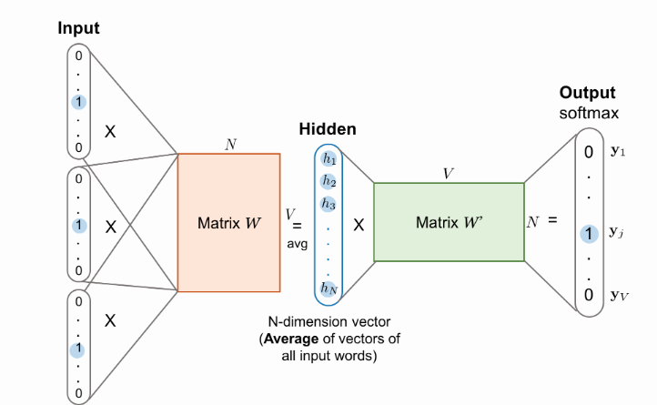
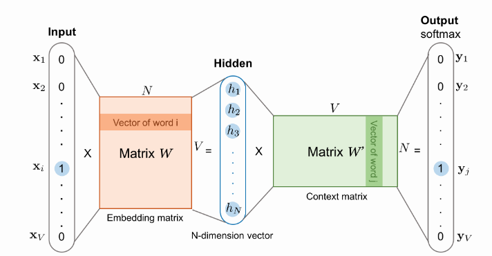

# Word2vec

&nbsp;&nbsp;In this assignment, I'll lead you through using Numpy to implement the word2vec algorithm using the skip-gram architecture. By implementing this, you'll learn about embedding words for use in natural language processing. This will come in handy when dealing with things like machine translation.

## Readings (reference)
&nbsp;&nbsp;Here are the resources I used to build this material. I suggest you to read these either beforehand or while your're working on this material.

[1] Francois Chaubard, Michael Fang, Guillaume Genthial, Rohit Mundra, Richard Socher, Winter 2019, CS224n: Natural Language Processing with Deep Learning 1 Lecture Notes: Part I Word Vectors I: Introduction, SVD and Word2Vec  
[2] Lilian Weng, (2017) 'Learning Word Embedding', *Github*, 15 Oct. Available at:https://lilianweng.github.io/lil-log/2017/10/15/learning-word-embedding.html

### Iteration Based Methods - Word2vec

&nbsp;&nbsp;Let's take a look at a new approach. Instead of computing and storing global information about some huge dataset (which might be billions of sentences), we can try to create a model that will be able to learn one iteration at a time and eventually be able to encode the probability of a word given its context.
The idea is to design a model whose parameters are the word vectors. Then, train the model on a certain objective. At every iteration we run our model, evaluate the errors, and follow an update rule that has some notion of penalizing the model parameters that caused the error. Thus, we learn our word vectors. This idea is a very old one dating back to 1986. We call this method "backpropagating" the errors. The simpler the model and the task, the faster it will be to train it.

&nbsp;&nbsp;Several approaches have been tested design models for NLP whose first step is to transform each word in a vector. For each special task (Named Entity Recognition, Part-of-Speech tagging, etc.) they train not only the model's parameters but also the vectors and achieve great performance, while computing good word vectors!

&nbsp;&nbsp;In this class, we will present a simpler, more recent, probabilistic method by [Mikolov et al., 2013] : word2vec. Word2vec is a software package that actually includes:

- 2 **algorithms**: **continuous bag-of-words (CBOW)** and **skip-gram**. CBOW aims to predict a center word from the surrounding context in terms of word vectors. Skip-gram does the opposite, and predicts the *distribution* (probability) of context words from a center word.
- 2 **training methods**: **negative sampling** and **hierarchical softmax**. Negative sampling defines an objective by sampling *negative examples*, while hierarchical softmax defines an objective using an efficient tree structure to compute probabilities for all the vocabulary.

### Language Models(*Unigrams*, *Bigrams*, *etc*.)

&nbsp;&nbsp;First, we need to create such a model that will assign a probability to a sequence of tokens.     Let us start with an example:

*"The cat jumped over the puddle."*

&nbsp;&nbsp;A good language model will give this sentence a high probability because this is a completely valid sentence, syntactically and semantically. Similarly, the sentence "stock boil fish is toy" should have a very low probability because it makes no sense. Mathematically, we can call this probability on any given sequence of *n* words:

&nbsp;&nbsp;We can take the unary language model approach and break apart this probability by assuming the word occurrences are completely independent:

&nbsp;&nbsp;However, we know this is a bit ludicrous because we know the next word is highly contingent upon the previous sequence of words. And the silly sentence example might actually score highly. So perhaps we let the probability of the sequence depend on the pairwise probability of a word in the sequence and the word next to it. We call this the bigram model and represent it as:

&nbsp;&nbsp;Again this is certainly a bit naive since we are only concerning ourselves with pairs of neighboring words rather than evaluating a whole sentence, but as we will see, this representation gets us pretty far long. Note in the Word-Word Matrix with context of size 1, we basically can learn these pairwise probabilities. But again, this would require computing and storing global information about a massive dataset.

&nbsp;&nbsp;Now that we understand how we can think about a sequence of tokens having a probability, let us observe some example models that could learn these probabilities

### Continuous Bag of Words Model (CBOW)

&nbsp;&nbsp;One approach is to treat {"The", "cat", "over", "the", "puddle"} as a context and from these words, be able to predict or generate the center word "jumped". This type of model we call a Continuous Bag of Words (CBOW) Model.

&nbsp;&nbsp;Let's discuss the CBOW Model above in greater detail. First, we set up our known parameters. Let the known parameters in our model be the sentence represented by one-hot word vectors. The input one hot vectors or context we will represent with an . And the output as  and in the CBOW model, since we only have one output, so we just call this  which is the one hot vector of the known center word. Now, let's define our unknowns in our model.

&nbsp;&nbsp;We create two matrices, . Where  is an arbitrary size which defines the size of our embedding space.  is the input word matrix such that the *i*-th column of  is the n-dimensional embedded vector for word  when it is an input to this model. We denote this  vector as . Similary,  is the output word matrix. The *j*-th row of  is an *n*-dimensional embedded vector for word  when it is an output of the model. We denote this row of  as . Note that we do in fact learn two vectors for every word  (i.e. input word vector  and output word vector ).

  
[image source from Lilian Weng's blog](https://lilianweng.github.io/lil-log/2017/10/15/learning-word-embedding.html "Lilian Weng")

&nbsp;&nbsp;We breakdown the way this model works in these steps:
1. We generate our one hot word vectors for the input context of size
.
2. We get our embedded word vectors for the context 
3. Average these vectors to get  
4. Generate a score vector . As the dot product of similar vectors is higher, it will push similar words close to each other in order to achieve a high score.
5. Turn the scores into probabilities 
6. We desire our probabilities generated, , to match the true probabilities,, which also happens to be the one hot vector of the actual word.

&nbsp;&nbsp;So now that we have an understanding of how our model would work if we had a W and W', how would we learn these two matrices? Well, we need to create an objective function. Very often when we are trying to learn a probability from some true probability, we look to information theory to give us a measure of the distance between two distributions. Here, we use a popular choice of distance/loss measure, cross entropy .

&nbsp;&nbsp;The intuition for the use of cross-entropy in the discrete case can be derived from the formulation of the loss funciton:

&nbsp;&nbsp;Let us concern ourselves with the case at hand, which is that  is a one-hot vector. Thus we know that the above loss simplifies to simply:

&nbsp;&nbsp;In this formulation,  is the index where the correct word's one hot vector is 1. We can now consider the case where our prediction was perfect and thus . We can then calculate . Thus,for a perfect prediction, we face no penalty or loss. Now let us consider the opposite case where our prediction was very bad and thus . As before, we can calculate our loss to be . We can thus see that for probability distributions, cross entropy provides us with a good measure of distance. We thus formulate our optimization objective as: 

&nbsp;&nbsp;We use stochastic gradient descent to update all relevant word vectors .

### Skip-Gram Model
&nbsp;&nbsp;Another approach to create a model such that given the center word "jumped", the model will be able to predict or generate the surrounding words "The", "cat", "over", "the", "puddle". Here we call the word "jumped" the context. We call this type of model a Skip-Gram model.

  
[image source from Lilian Weng's blog](https://lilianweng.github.io/lil-log/2017/10/15/learning-word-embedding.html "Lilian Weng")

&nbsp;&nbsp;Let's discuss the Skip-Gram model above. The setup is largely the same but we essentially swap our *x* and *y* i.e. *x* in the CBOW are now *y* and vice-versa. The input one hot vector (center word) we will represent with an *x* (since there is only one). And the output vectors as . We define  and  the same as in CBOW.

&nbsp;&nbsp;We breakdown the way this model works in these 6 steps:
1. We generate our one hot input vector  of the center word
2. We get our embedded word vector for the center word 
3. Generate a score vector 
4. Turn the score vector into probabilities,  are the probabilities of observing each context word.
5. We desire our probability vector generated to match the true probabilities which is , the one hot vectors of the actual output.

&nbsp;&nbsp;As in CBOW, we need to generate an objective function for us to evaluate the model. A key difference here is that we invoke a Naive Bayes assumption to break out the probabilities. If you have not seen this before, then simply put, it is a strong (naive) conditional independence assumption. In other words, given the center word, all output words are completely independent.

![equation](https://latex.codecogs.com/gif.latex?minimize%20J%20%3D%20-%5Clog%20P%28word_%7Bc-m%7D%2C...%2Cword_%7Bc-1%7D%2Cword_%7Bc&plus;1%7D%2C...%2Cword_%7Bc&plus;m%7D%7Cword_%7Bc%7D%29%20%5C%5C%20%5C%3B%5C%3B%5C%3B%5C%3B%5C%3B%5C%3B%5C%3B%5C%3B%5C%3B%5C%3B%5C%3B%5C%3B%5C%3B%5C%3B%3D%20-%5Clog%20%5Cprod_%7Bj%3D0%2Cj%20%5Cneq%20m%7D%5E%7B2m%7D%20P%28word_%7Bc-m&plus;j%7D%7Cword_%7Bc%7D%29%20%5C%5C%20%5C%3B%5C%3B%5C%3B%5C%3B%5C%3B%5C%3B%5C%3B%5C%3B%5C%3B%5C%3B%5C%3B%5C%3B%5C%3B%5C%3B%20%3D%20-%5Clog%20%5Cprod_%7Bj%3D0%2Cj%20%5Cneq%20m%7D%5E%7B2m%7D%20P%28w%7B%27%7D_%7Bc-m&plus;j%7D%7Cw_%7Bc%7D%29%20%5C%5C%20%5C%3B%5C%3B%5C%3B%5C%3B%5C%3B%5C%3B%5C%3B%5C%3B%5C%3B%5C%3B%5C%3B%5C%3B%5C%3B%5C%3B%20%3D%20-%5Clog%20%5Cprod_%7Bj%3D0%2Cj%20%5Cneq%20m%7D%5E%7B2m%7D%20%5Cfrac%7Bexp%28w%7B%27%7D_%7Bc-m&plus;j%7D%5E%7BT%7Dw_%7Bc%7D%29%7D%7B%5Csum_%7Bk%3D1%7D%5E%7B%7CV%7C%7Dexp%28w%7B%27%7D_%7Bk%7D%5E%7BT%7Dw_%7Bc%7D%29%7D%20%5C%5C%20%5C%3B%5C%3B%5C%3B%5C%3B%5C%3B%5C%3B%5C%3B%5C%3B%5C%3B%5C%3B%5C%3B%5C%3B%5C%3B%5C%3B%20%3D%20-%20%5Csum_%7Bj%3D0%2C%20j%20%5Cneq%20m%7D%5E%7B2m%7D%20w%7B%27%7D_%7Bc-m&plus;j%7D%5E%7BT%7Dw_%7Bc%7D%20&plus;%202m%5Clog%20%5Csum_%7Bk%3D1%7D%5E%7B%7CV%7C%7D%20exp%28w%7B%27%7D_%7Bk%7D%5E%7BT%7Dw_%7Bc%7D%29)

&nbsp;&nbsp;With this objective function, we can compute the gradients with respect to the unknown parameters and at each iteration update them via Stochastic Gradient Descent.

&nbsp;&nbsp;Note that

&nbsp;&nbsp;where  is the cross-entropy between the probability vector  and one-hot vector  

### Negative Sampling

Lets take a second to look at objective function. Note that the summation over  is computationally huge! Any update we do or evaluation of the objective function would take  time which if we recall is in the millions. A simple idea is we could instead just approximate it.

&nbsp;&nbsp;For every training step, instead of looping over the entire vocabulary, we can just sample several negative samples! We "sample" from a noise distribution  whose probabilities match the ordering of the frequency of the vocabulary. To augment our formulation of the problem to incorporate Negative Sampling, all we need to do is update the:
* objective function
* gradients
* update rules

[**MIKOLOV ET AL.**](https://papers.nips.cc/paper/5021-distributed-representations-of-words-and-phrases-and-their-compositionality.pdf) present **Negative Sampling** in DISTRIBUTED REPRESENTATIONS OF WORDS AND PHRASES AND THEIR COMPOSITIONALITY. While negative sampling is based on Skip-Gram model, it is in fact optimizing a different objective. Consider a pair  of word and context. Did this pair come from the training data? Let's denote by  the probability that  came from the corpus data. Correspondingly,  will be the probability that  did not come from the corpus data. First, let's model  with the sigmoid function:

&nbsp;&nbsp;Now, we build a new objective function that tries to maximize the probability of a word and context being in the corpus data if it indeed is, and maximize the probability of a word and context not being in the corpus data if it indeed is not. We take a simple maximum likelihood approach of these two probabilities. (Here we take  to be the parameters of the model, and in our case it is  and .)

![equation](https://latex.codecogs.com/gif.latex?%5Ctheta%20%3D%20argmax_%7B%5Ctheta%7D%20%5Cprod_%7B%28w%2Cc%29%20%5Cin%20D%7D%20P%28D%20%3D%201%7Cw%2Cc%2C%5Ctheta%29%20%5Cprod_%7B%28w%2Cc%29%20%5Cin%20%5Ctilde%7BD%7D%7D%20P%28D%20%3D%200%7Cw%2Cc%2C%5Ctheta%29%20%5C%5C%20%5C%3B%5C%2C%3D%20argmax_%7B%5Ctheta%7D%20%5Cprod_%7B%28w%2Cc%29%20%5Cin%20D%7D%20P%28D%20%3D%201%7Cw%2Cc%2C%5Ctheta%29%20%5Cprod_%7B%28w%2Cc%29%20%5Cin%20%5Ctilde%7BD%7D%7D%20%281%20-%20P%28D%20%3D%201%7Cw%2Cc%2C%5Ctheta%29%29%20%5C%5C%20%5C%3B%5C%2C%20%3D%20argmax_%7B%5Ctheta%7D%20%5Csum_%7B%28w%2Cc%29%20%5Cin%20D%7D%20%5Clog%20P%28D%20%3D%201%7Cw%2Cc%2C%5Ctheta%29%20&plus;%20%5Csum_%7B%28w%2Cc%29%20%5Cin%20%5Ctilde%7BD%7D%7D%20%5Clog%281%20-%20P%28D%3D1%7Cw%2Cc%2C%5Ctheta%29%29%20%5C%5C%20%5C%3B%5C%2C%20%3D%20argmax_%7B%5Ctheta%7D%20%5Csum_%7B%28w%2Cc%29%20%5Cin%20D%7D%20%5Clog%20%5Cfrac%7B1%7D%7B1%20&plus;%20exp%28-w%7B%27%7D%5E%7BT%7D_%7Bw%7Dw_%7Bc%7D%29%7D%20&plus;%20%5Csum_%7B%28w%2Cc%29%20%5Cin%20%5Ctilde%7BD%7D%7D%20%5Clog%281-%20%5Cfrac%7B1%7D%7B1&plus;exp%28-w%7B%27%7D%5E%7BT%7D_%7Bw%7Dw_%7Bc%7D%29%7D%29%20%5C%5C%20%5C%3B%5C%2C%20%3D%20argmax_%7B%5Ctheta%7D%20%5Csum_%7B%28w%2Cc%29%20%5Cin%20D%7D%20%5Clog%20%5Cfrac%7B1%7D%7B1%20&plus;%20exp%28-w%7B%27%7D%5E%7BT%7D_%7Bw%7Dw_%7Bc%7D%29%7D%20&plus;%20%5Csum_%7B%28w%2Cc%29%20%5Cin%20%5Ctilde%7BD%7D%7D%20%5Clog%28%20%5Cfrac%7B1%7D%7B1&plus;exp%28w%7B%27%7D%5E%7BT%7D_%7Bw%7Dw_%7Bc%7D%29%7D%29)

Note that maximizing the likelihood is the same as minimizing the negative log likelihood

Note that  is a "false" or "negative" corpus. Where we would have sentences like "stock boil fish is toy". Unnatural sentences that should get a low probability of ever occurring. We can generate  on the fly by randomly sampling this negative form the word bank.

For skip-gram, our new objective function for observing the context word c-m+j given the center word c would be

For CBOW, our new objective function for observing the center word  given the context vector  would be 

In the above formulation,  are sampled from . Let's discuss what  should be. While there is much discussion of what makes the best approximation, what seems to work best is the Unigram Model raised to the power of 3/4. Why 3/4? Here's an example that might help gain some intuition:

"Bombastic" is now 3x more likely to be sampled while "is" only went up marginally.

* **Soft sliding window**. When pairing the words within the sliding window, we could assign less weight to more distant words. One heuristic is - given a maximum window size parameter defined, , the actual window size is randomly sampled between 1 and  for every training sample. Thus, each context word has the probability of 1/(its distance to the target word) being observed, while the adjacent words are always observed.

* **Subsampling frequent words**. Extremely frequent words might be too general to differentiate the context (i.e. think about stopwords). While on the other hand, rare words are more likely to carry distinct information. To balance the frequent and rare words, Mikolov et al. proposed to discard words  with probability  during sampling. Here  is the word frequency and  is an adjustable threshold.

> **Exercise 1-1**: To fill in the **forward**, **backward** and **optimize** functions see the loss function of the negative sampling.   &nbsp;&nbsp;&nbsp;&nbsp;&nbsp;&nbsp;&nbsp;&nbsp;&nbsp;&nbsp;&nbsp;&nbsp;&nbsp;&nbsp;&nbsp;&nbsp;&nbsp;&nbsp;&nbsp;&nbsp;  
Calculate the gradient for each variables, ,  and then implement the code by filling the blank in the **forward**, **backward** and **optimize** function.
(Note that you should calculate equations first!)  
&nbsp;&nbsp;&nbsp;&nbsp;&nbsp;&nbsp;&nbsp;&nbsp;&nbsp;&nbsp;&nbsp;&nbsp;&nbsp;&nbsp;&nbsp;&nbsp;&nbsp;&nbsp;&nbsp;&nbsp;  
&nbsp;&nbsp;&nbsp;&nbsp;&nbsp;&nbsp;&nbsp;&nbsp;&nbsp;&nbsp;&nbsp;&nbsp;&nbsp;&nbsp;&nbsp;&nbsp;&nbsp;&nbsp;&nbsp;&nbsp;  
&nbsp;&nbsp;&nbsp;&nbsp;&nbsp;&nbsp;&nbsp;&nbsp;&nbsp;&nbsp;&nbsp;&nbsp;&nbsp;&nbsp;&nbsp;&nbsp;&nbsp;&nbsp;&nbsp;&nbsp;

> **Exercise 1-2**: In a nutshell, subsampling is a method of diluting very frequent words, akin to removing stop words. The subsampling method presented in (Mikolov et el., 2013) randomly removes words that are more frequent than some threshold  with a probability , where  marks the word's corpus frequency:  
&nbsp;&nbsp;&nbsp;&nbsp;&nbsp;&nbsp;&nbsp;&nbsp;&nbsp;&nbsp;&nbsp;&nbsp;&nbsp;&nbsp;&nbsp;&nbsp;&nbsp;&nbsp;&nbsp;&nbsp;  
However, word2vec's code uses a slightly different formula than the one mentioned in the paper:  
&nbsp;&nbsp;&nbsp;&nbsp;&nbsp;&nbsp;&nbsp;&nbsp;&nbsp;&nbsp;&nbsp;&nbsp;&nbsp;&nbsp;&nbsp;&nbsp;&nbsp;&nbsp;&nbsp;&nbsp;  
Implement the code by filling the **subsampling** function.  
(Note that for a random variable X which follows uniform distribution there's a probability p then &nbsp;&nbsp;&nbsp;&nbsp;&nbsp;&nbsp;&nbsp;&nbsp;&nbsp;&nbsp;&nbsp;&nbsp;&nbsp;&nbsp;&nbsp;&nbsp;&nbsp;&nbsp;&nbsp;&nbsp;   I recommend you to implement the second version)

